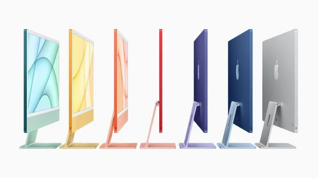

# Mac 최신 루머: Apple의 새로운 모델 출시 시기는? (2022년12월)

MacBook Pro에서 Mac Pro, Mac mini, iMac, Mac Studio 및 MacBook Air에 대한 신제품 루머들에 대해서 정리해보았습니다.

## 맥북 프로

<component is="script" src="https://pagead2.googlesyndication.com/pagead/js/adsbygoogle.js?client=ca-pub-4877378276818686" crossorigin="anonymous" async></component>

<!-- ui-log 수평형 -->

<ins class="adsbygoogle"
     style="display:block"
     data-ad-client="ca-pub-4877378276818686"
     data-ad-slot="9743150776"
     data-ad-format="auto"
     data-full-width-responsive="true"></ins>
<component is="script">
(adsbygoogle = window.adsbygoogle || []).push({});
</component>

최신 14인치 및 16인치 MacBook Pro는 2021년 10월에 발표되어 1년이 넘었습니다.
재설계된 MacBook Pro는 M1 Pro 및 M1 Max 칩을 탑재한 Apple의 첫 번째 하이엔드 Mac이었습니다.
애플은 지난 가을 업데이트된 모델을 발표할 것으로 널리 예상되었지만 2023년 출시 계획을 연기했습니다.

Bloomberg의 Mark Gurman에 따르면 M2 Pro 및 M2 Max 칩 옵션이 포함된 새로운 14인치 및 16인치 MacBook Pro 모델이 2023년 상반기에 출시될 예정입니다.
작년에 Apple은 M1 iMac을 발표하는 4월 이벤트를 개최했습니다.
새로운 Apple TV, AirTags 및 iPad Pro. 2023년 상반기에 Apple은 새로운 MacBook Pro 및 기타 신제품을 발표하기 위해 또 다른 봄 이벤트를 열 수 있습니다.

새로운 MacBook Pro는 작년에 소개된 디자인을 고수하면서 큰 변화가 없을 것으로 예상됩니다.
대신, 그들은 현재 M1 Pro 및 M1 Max 변형에 비해 더 높은 성능과 배터리 효율성을 제공하는 M2 Pro 및 M2 Max 칩의 이점을 누릴 것입니다.

## IMAC

<component is="script" src="https://pagead2.googlesyndication.com/pagead/js/adsbygoogle.js?client=ca-pub-4877378276818686" crossorigin="anonymous" async></component>

<!-- ui-log 수평형 -->

<ins class="adsbygoogle"
     style="display:block"
     data-ad-client="ca-pub-4877378276818686"
     data-ad-slot="9743150776"
     data-ad-format="auto"
     data-full-width-responsive="true"></ins>
<component is="script">
(adsbygoogle = window.adsbygoogle || []).push({});
</component>

현재 iMac은 2021년 4월 M1 칩과 함께 발표되었습니다. M1 칩의 효율성 덕분에 Apple은 iMac을 더 얇은 폼 팩터로 완전히 재설계할 수 있었습니다. 현재 iMac은 24인치 디스플레이의 얇은 디자인을 특징으로 하며 액세서리와 함께 다양한 색상으로 제공됩니다.

24인치 iMac은 회사가 27인치 및 21.5인치 모델을 단종함에 따라 Apple 라인업의 유일한 iMac입니다. 다음 iMac의 경우 큰 변화는 없을 것으로 예상됩니다. Gurman에 따르면 기존 24인치 iMac의 후속 제품이 작업 중이지만 Apple이 아직 발표하지 않은 M3 칩과 함께 2023년 후반까지 출시될 것 같지는 않습니다.

업데이트된 iMac은 주요 디자인 변경 사항이 없을 것 같지만 M3 칩의 이점을 누릴 수 있습니다. 또한 Apple이 단종된 iMac 모델에 사용되는 이름인 "iMac Pro"라는 iMac의 고급 버전을 개발 중이라는 보고도 있습니다. Gurman은 Apple이 더 하이엔드 iMac 옵션에 여전히 관심이 있지만 제품이 내부적으로 지연되고 있다고 말했습니다.

## Mac mini

Mac mini는 Apple의 가장 작고 휴대성이 뛰어난 Mac으로, 휴대성과 다재다능함을 즐기는 고객에게 인기 있는 옵션입니다. 최신 Mac mini는 2020년 11월에 M1 칩을 획득한 최초의 Mac 중 하나였으며, 그 이후로 Apple은 Mac mini 애호가에게 최신 모델을 제공하지 않았습니다. Apple이 재설계된 Mac mini를 작업 중이라는 수많은 소문이 있었지만 그 이후 이러한 계획은 사라졌다고 합니다.

Gurman에 따르면 Apple은 2023년 출시를 위해 M2 Pro 및 M2 Max 칩이 탑재된 Mac mini 모델을 테스트하고 있습니다. 현재 Mac mini의 알루미늄 유니바디 디자인은 2010년 이후 모든 새로운 Mac mini에 사용되었습니다. Apple은 M1 칩이 있는 모델과 함께 Intel 기반 Mac mini를 계속 판매하고 있습니다.

## Macbook Air

M2 MacBook Air는 지난 6월에 발표된 Apple의 최신 Mac입니다. 새로운 MacBook Air는 얇고 가벼운 폼 팩터를 위해 이전 모델의 쐐기 모양을 탈피한 새로운 디자인을 갖추고 있습니다. MacBook Air는 13인치 디스플레이에 M2 칩으로 구동되며 4가지 색상으로 제공됩니다.

MacBook Air가 최근에 발표된 것을 감안할 때 우리는 가까운 시일 내에 후속 제품을 기대하지 않습니다. 그러나 우리는 2023년에 MacBook Air 제품군에 새로운 제품이 추가될 것으로 예상하고 있습니다. 신뢰할 수 있는 디스플레이 분석가인 Ross Young에 따르면 Apple은 빠르면 내년 봄에 15.5인치 디스플레이가 장착된 MacBook Air를 발표할 것이라고 합니다.

새로운 MacBook Air는 평평한 가장자리, 대형 Force Touch 트랙패드, 기능 키가 있는 키보드, MagSafe 충전 포트 등 기존 13인치 모델과 전체 디자인이 동일할 것으로 예상됩니다. 15.5인치에서 곧 출시될 MacBook Air는 14인치와 16인치 MacBook Pro 사이에 위치하며 현재까지 가장 큰 ‌MacBook Air‌가 될 것입니다.

## Mac Pro

<component is="script" src="https://pagead2.googlesyndication.com/pagead/js/adsbygoogle.js?client=ca-pub-4877378276818686" crossorigin="anonymous" async></component>

<!-- ui-log 수평형 -->

<ins class="adsbygoogle"
     style="display:block"
     data-ad-client="ca-pub-4877378276818686"
     data-ad-slot="9743150776"
     data-ad-format="auto"
     data-full-width-responsive="true"></ins>
<component is="script">
(adsbygoogle = window.adsbygoogle || []).push({});
</component>

Mac Pro는 Apple의 가장 강력한 Mac입니다. 현재 Mac Pro는 3년이 넘었기 때문에 업그레이드가 늦어졌습니다. ‌Mac Pro‌는 Apple 라인업에서 아직 Apple 실리콘으로 전환되지 않은 유일한 Mac이며 여전히 전적으로 Intel 칩으로 구동됩니다.

Apple은 한동안 Apple 실리콘 Mac Pro를 테스트했지만 제품 개발에 몇 가지 문제가 있는 것으로 알려졌습니다. Gurman에 따르면, 곧 출시될 Mac Pro에 M2 Ultra 및 M2 Extreme 칩을 제공하려는 Apple의 원래 계획은 계획대로 되지 않을 수 있습니다. 저널리스트에 따르면, Apple은 가장 강력한 Apple 실리콘 칩인 M2 Extreme을 Mac Pro에 제공하려는 계획을 포기했습니다. 대신 Mac Pro는 M2 Ultra 칩만 제공되며 구성과 확장성이 다릅니다.

곧 출시될 Mac Pro를 예상할 수 있는 정확한 기간은 아직 알려지지 않았지만 아마도 2023년 언젠가 예상될 수 있습니다.

## Mac Studio

Mac Studio는 2022년 3월 Apple 실리콘 Mac Pro가 출시될 때까지 최고급 Mac 데스크톱으로 발표되었습니다. Mac Studio는 Mac mini와 비슷한 컨셉을 가지고 있지만 더 큰 폼 팩터에 더 많은 포트와 성능을 제공합니다. 현재 Mac Studio는 M1 Max 및 M1 Ultra 칩 옵션과 함께 제공됩니다. Mac Studio 업데이트의 경우 중요한 변경 사항에 대해 많이 듣지 못했지만 M2 Max 및 M2 Ultra 칩 업데이트를 볼 수 있습니다.

최근에 발굴된 Geekbench 점수와 데이터베이스 스폿팅은 Apple이 곧 출시될 Mac Studio와 함께 M2 Max 칩을 내부적으로 테스트하고 있음을 밝혔습니다. Apple이 연간 업데이트 일정을 고수한다면 이번 봄에 Mac Studio가 새로워지는 것을 보게 될 것입니다.
